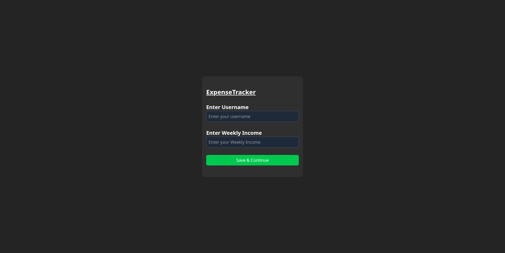
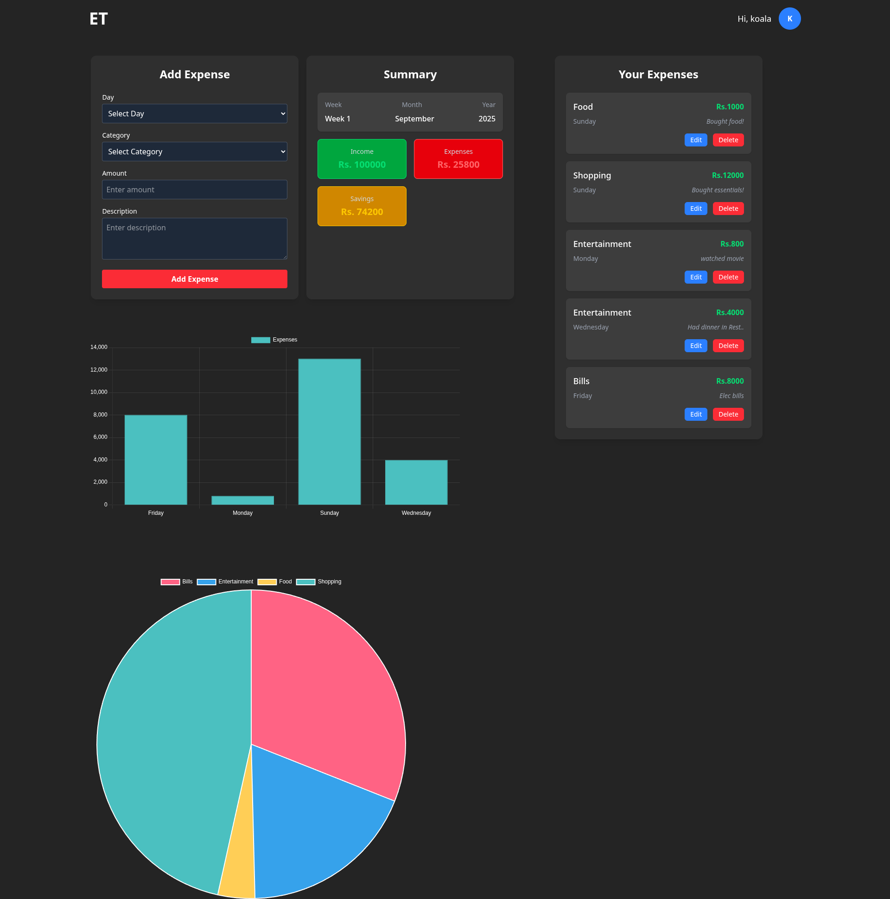
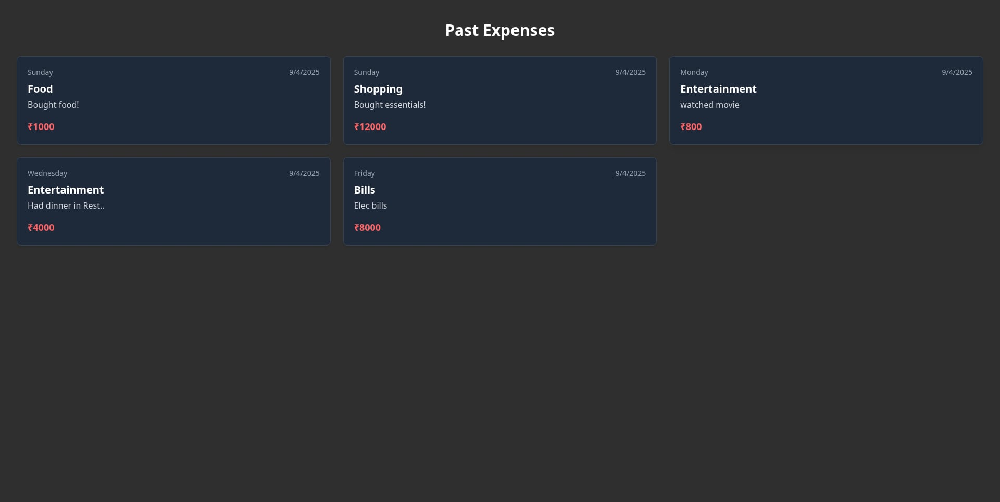
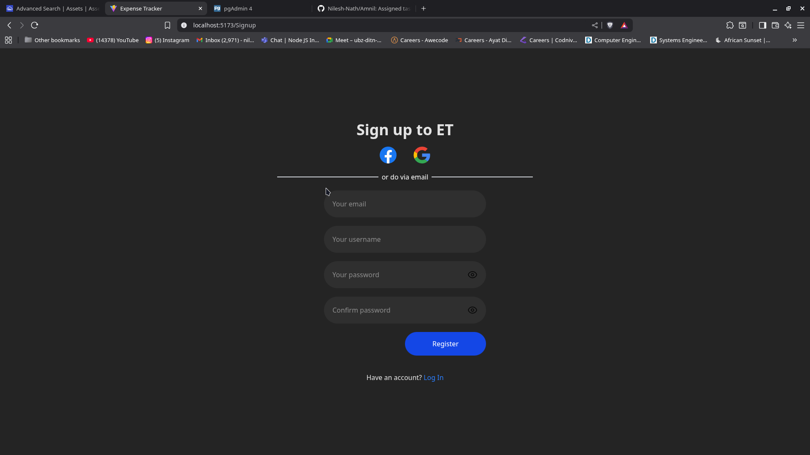
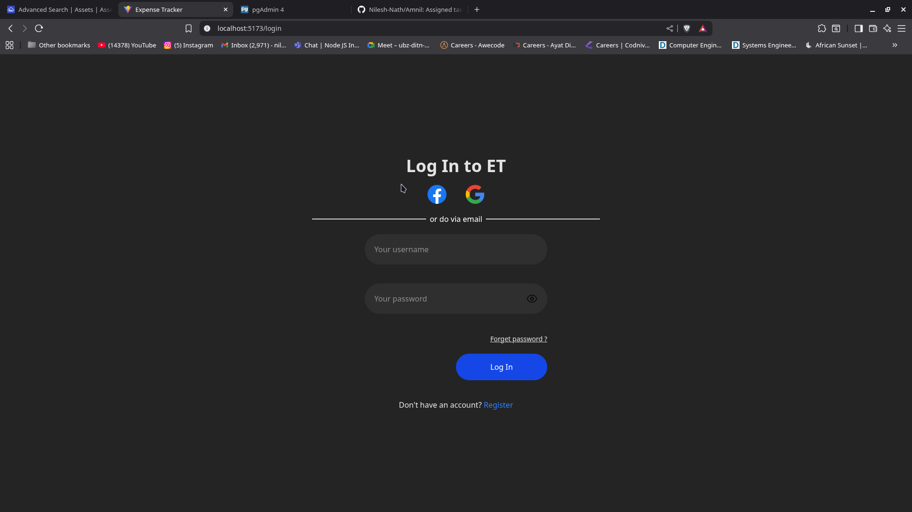
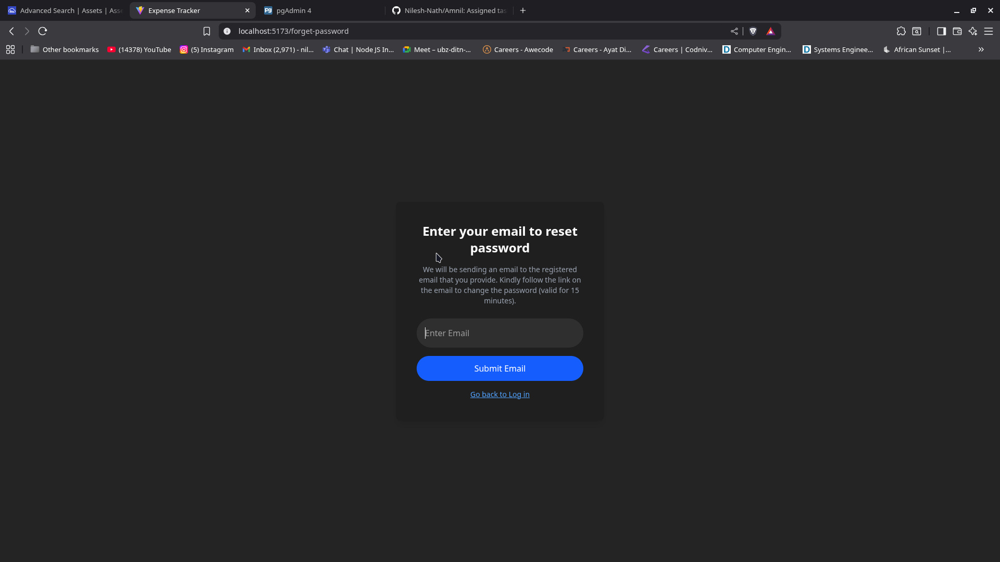
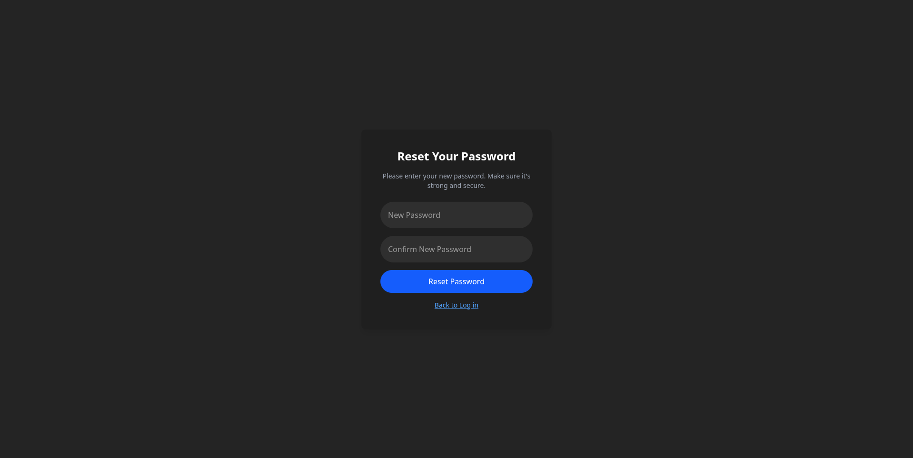
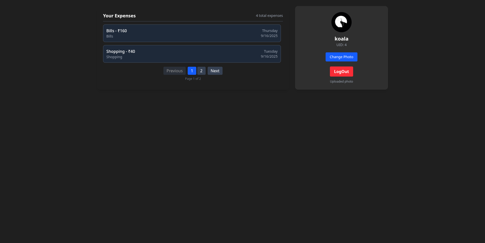

# 🧾 Expense Tracker - Task 1 (Amnil Technologies)

This is a simple Expense Tracker  built using **React.js** for the frontend and **Node.js/Express** for the backend . This is part of **Task 1** assigned by **Amnil Technologies**.

---

## 📌 Features

- User enters a **username** and **weekly income**
- Data is submitted to the backend using **Axios**
- Upon success, user is redirected to a **Dashboard**
- Dashboard displays:
  - Add expense form
  - Daily and category-wise expense breakdown
  - Summary section
  - List of expenses
  - Navigation bar

---

## 🛠️ Tech Stack

### Frontend
- React.js
- Tailwind CSS
- Axios
- React Router

### Backend (Expected)
- Node.js
- Express.js
- Postgres
- CORS + Cookie-based auth (based on `withCredentials:true`)

---

## 🖼️ Screenshots

### 🧾 Income Input Page

### 📊 Dashboard

### 📊 Past Expenses

# Task 2

This project implements a full authentication system with user management, image upload, and logging.  

## Features
- **Login & Signup** using **bcrypt** for password hashing  
- **JWT authentication** with **Access Token** and **Refresh Token**  
- **Auth Context** for managing authentication state in frontend  
- **Auth Middleware** to protect routes  
- **Forget Password** functionality using **nodemailer** and **crypto**  
- **Profile Image Upload** using **Cloudinary**, with secure storage of user profile pictures  
- **Logging** implemented with **winston** and **morgan**  
- **Implemented Backend Pagination**
- **Implemented API Documentation** using **Swagger UI**
## Packages Used

- Authentication: bcrypt, JWT (Access + Refresh Tokens), Auth Middleware
- Email & Password Recovery: nodemailer, crypto
- Image Storage: Cloudinary
- Frontend State Management: React Context 
- Logging: winston, morgan
- Database: PostgreSQL

## 🖼️ Screenshots

###  Signup page

###  Login Page

### Forget Password

### Reset Password

### Profile

